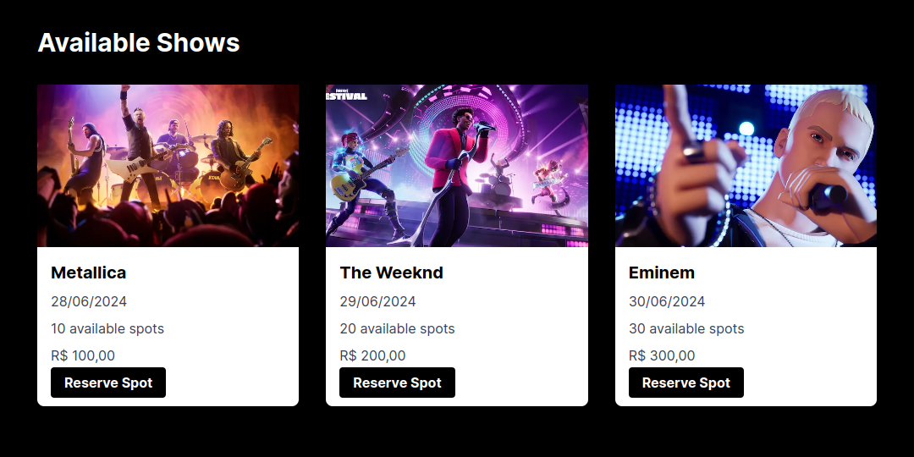
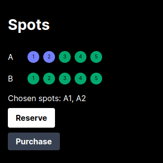
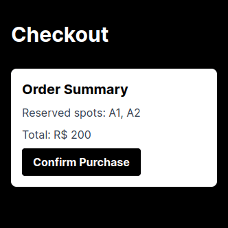

## Next.js 14 Training Server Side Rendering Concepts

> 👨‍💻 Developed by Matheus Ramalho de Oliveira  
🏗️ Brazilian Software Engineer  
✉️ kastorcode@gmail.com  
🦫 [LinkedIn](https://br.linkedin.com/in/kastorcode) • [Instagram](https://instagram.com/kastorcode)

---

  

  This repository is a full-stack project to train concepts of the Next.js server side rendering framework on version 14: a Node.js API with Express to serve data, page system based on folder structure, Next.js data fetching, caching and revalidate, “use server” directive, cookies, and Tailwind CSS for styling. The app simulates purchasing tickets for shows.

---

### Screenshots

  
  
  

---

### Installation and execution

Backend

1. Make a clone of this repository;
2. Open the project folder in a terminal;
3. Run `yarn` to install dependencies;
4. Run `yarn start:api` to launch server at `http://localhost:8000`.

Frontend

1. Run `yarn dev` to start Next.js at `http://localhost:3000`.

The `api.http` file has CURL requests that can be made using the [REST Client](https://marketplace.visualstudio.com/items?itemName=humao.rest-client) extension.

---

  <big><b>&lt;kastor.code/&gt;</b></big>

